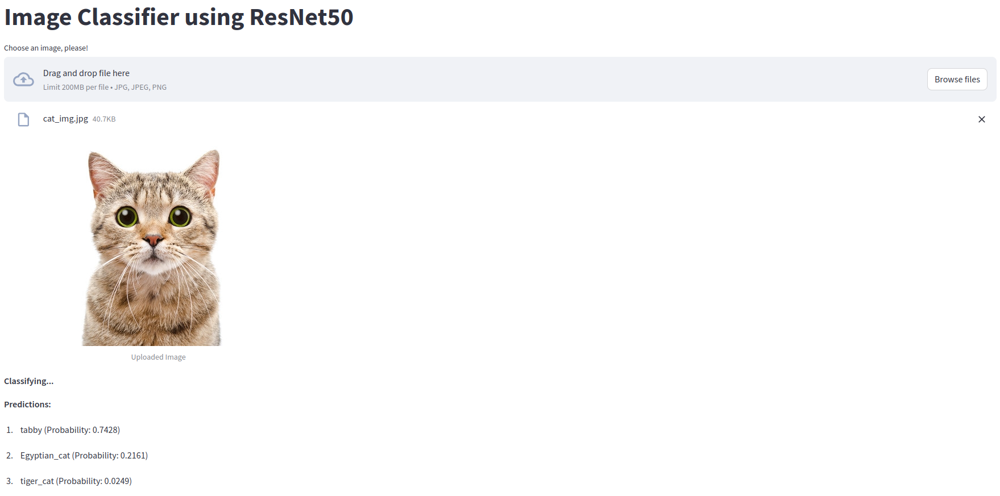
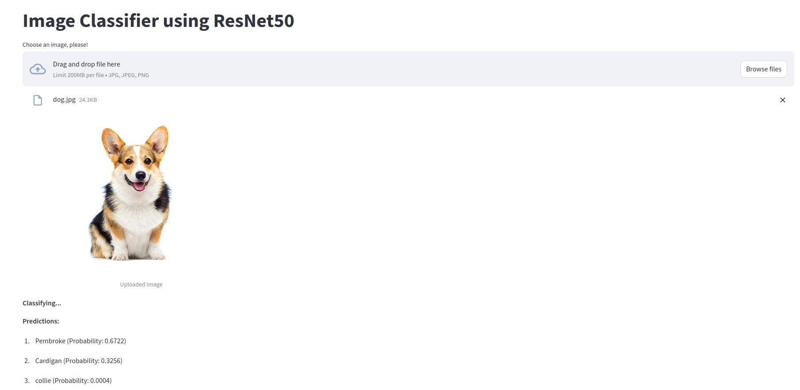

# RestNet50 + FastAPI + Streamlit

Developing a RESTful API using **FastAPI** to accept an image and return the image type using the ResNet50 (ImageNet) model.

- Using pre-trained model **RestNet50**
- API data contract:
  - Port: 8000
  - URL:http://localhost:8000/classify
  - Method: POST
  - Parameters: image_file

- Dashboard using **Streamlit** for animal image prediction.

## Predictions

**Cat**.

**Dog**

